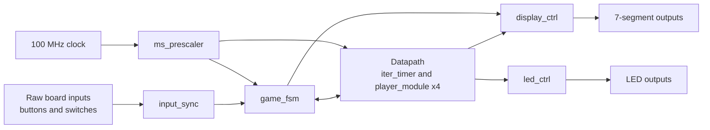

Four-player Red Light, Green Light game implemented on the Nexys A7-100T, where each player uses a slide switch to move toward a 10 m finish line during Green Light and is eliminated for moving during Red Light.

The game runs entirely in FPGA hardware. A push button starts each Green Light interval, the interval gets shorter over ten rounds, and the game ends when a player reaches 10,000 mm, all players are eliminated, or the tenth round expires with no winner. The 7-segment display shows time remaining, player progress/status, and the current round; the LEDs show active players, eliminated players, and the winner.

The VHDL is organized as an FSMD around one 100 MHz clock. `game_fsm` controls the Red Light, timer-load, Green Light, and game-over states, while `iter_timer` and four `player_module` instances keep the countdown, player distances, and player statuses. `rlgl_top` wires the eight blocks structurally; the design closes timing at 100 MHz with +3.981 ns WNS and passes eight self-checking ModelSim scenarios.

**Demo**

Hardware demo on Nexys A7-100T: [docs/demo.mp4](docs/demo.mp4)

The video covers the main hardware cases: a normal round, Red Light elimination, timeout after ten iterations, all players eliminated, and a winning player.

**Architecture**

`input_sync` cleans up the board inputs. `ms_prescaler` generates `ms_tick`. `game_fsm` moves through IDLE, LOAD, GREEN, and GAME_OVER. `iter_timer` loads the current Green Light duration and counts it down. Four generated `player_module` instances track distance and player state. `display_ctrl` drives the 8-digit 7-segment display, `led_ctrl` drives the player LEDs, and `rlgl_top` ties the blocks together.



**Verification**

All 8 scenarios pass with self-checking assertions. Final simulation message: `ALL TESTS COMPLETED SUCCESSFULLY`.

| Scenario | What It Verifies |
| --- | --- |
| 1 | Reset and initial state: FSM in IDLE, iter_count = 0, all players ST_ACTIVE, distances zero, winner_exists and all_eliminated low. |
| 2 | One full iteration, no player action: start press goes through LOAD then GREEN, timer loads and counts down, returns to IDLE on timer_done. |
| 3 | Red Light elimination: switch UP during IDLE writes ST_ELIMINATED next clock. LED off. Other three still active. |
| 4 | Win scenario for Player 1: distance accumulates 1 mm/ms during Green Light. At 10,000 mm: ST_WINNER, winner_exists, GAME_OVER. |
| 5 | Button ignored in GAME_OVER: btn_pulse in GAME_OVER does nothing. Only reset exits. |
| 6 | All players eliminated: all switches UP in IDLE, everyone eliminated, all_eliminated asserts, GAME_OVER. |
| 7 | Ten iterations, no winner: ten start presses, no movement. After the tenth timer expires, FSM sees MAX_ITERATIONS and enters GAME_OVER. |
| 8 | Partial elimination, continued play: some eliminated, survivors keep accumulating. Eliminated players stay eliminated. |

**Synthesis & Timing Results**

| Metric | Value |
| --- | --- |
| Target clock | clk_100mhz |
| Clock period | 10.000 ns |
| Target frequency | 100.000 MHz |
| Worst Negative Slack (WNS) | +3.981 ns |
| Total Negative Slack (TNS) | 0.000 ns |
| Worst Hold Slack (WHS) | +0.105 ns |
| Total Hold Slack (THS) | 0.000 ns |
| Pulse-width slack (WPWS) | +4.500 ns |

| Resource | Used | Available | Utilization |
| --- | ---: | ---: | ---: |
| Slice LUTs | 825 | 63,400 | 1.30% |
| Slice Registers | 133 | 126,800 | 0.10% |
| Bonded IOB | 27 | 210 | 12.86% |
| BUFGCTRL | 1 | 32 | 3.13% |

+3.981 ns WNS on a 10 ns period leaves roughly 40% margin. The design closes at 100 MHz with positive hold slack on every endpoint.

**How To Run**

Simulation with ModelSim:

```sh
vsim -do sim/sim.do
```

Run it from the repository root. The script builds the `work` library, compiles the package and VHDL files in dependency order, loads `work.rlgl_tb`, adds the waveform signals, and runs the full self-checking test sequence.

Synthesis with Vivado:

1. Create a project targeting `xc7a100tcsg324-1`.
2. Add VHDL sources from `src/`.
3. Add constraints from `constraints/rlgl_top.xdc`.
4. Run synthesis and implementation.
5. Generate the bitstream and program the Nexys A7-100T.

**Files**

| File | Description |
| --- | --- |
| `src/game_pkg.vhd` | Shared constants, types, status values, FSM states, display patterns, timing values, and game limits. |
| `src/input_sync.vhd` | Two-stage input synchronization, 20 ms start-button debounce, and single-cycle start pulse generation. |
| `src/ms_prescaler.vhd` | 100 MHz to 1 ms tick generator, with `SIM_FAST` for shorter simulations. |
| `src/game_fsm.vhd` | Four-state controller for iteration start, timer control, and game-over conditions. |
| `src/iter_timer.vhd` | Green Light duration ROM, optional LFSR offset path, and countdown timer. |
| `src/player_module.vhd` | Per-player status and distance registers with Red Light elimination and Green Light movement. |
| `src/display_ctrl.vhd` | Multiplexed 8-digit 7-segment display controller for time, player state, and iteration number. |
| `src/led_ctrl.vhd` | Player LED controller for active, eliminated, and winner states. |
| `src/rlgl_top.vhd` | Structural top level connecting the input, timing, control, datapath, display, and LED blocks. |
| `sim/rlgl_tb.vhd` | Self-checking ModelSim testbench with eight deterministic scenarios. |
| `sim/sim.do` | ModelSim compile, load, waveform, and run script. |
| `constraints/rlgl_top.xdc` | Nexys A7-100T clock, button, switch, LED, and 7-segment pin constraints. |

**License**

MIT, see [LICENSE](LICENSE).
